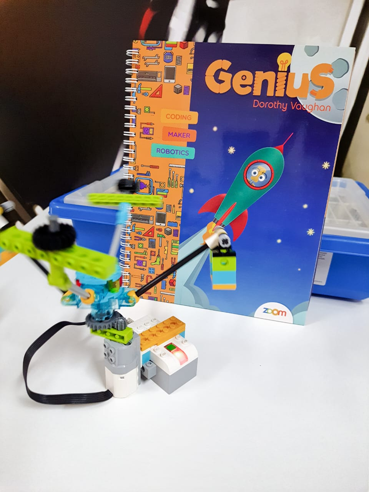

# Lego EV3 | Roboter

Projetos desenvolvidos durante o curso de Robótica da Visual Mídia, no nível Genius, dedicado ao aprendizado de robótica e programação para crianças.

## 🛠 Tecnologias

- WeDo 2.0